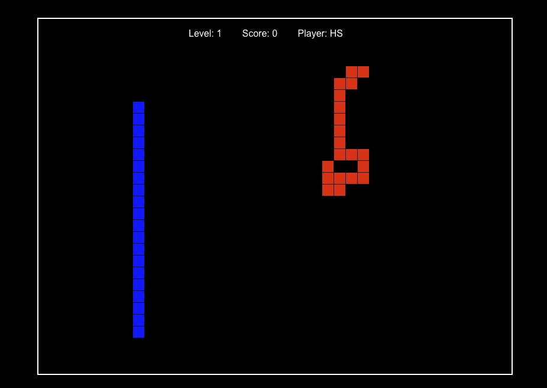

# Tron Light Cycle Game

This is a simple Tron-inspired light cycle game built using HTML5 Canvas, JavaScript, and Firebase. The game allows players to control a light cycle, compete against a CPU opponent, and progress through increasingly challenging levels. It also features a global leaderboard powered by Firebase.



## Features

- Player vs CPU gameplay
- Increasing difficulty with each level
- Global leaderboard using Firebase Realtime Database
- Anonymous authentication for players
- Responsive design for desktop browsers

## How to Play

1. Enter your name and click "Start Game"
2. Control your light cycle (blue) using arrow keys or WASD
3. Avoid hitting walls, obstacles, your own trail, or the CPU's trail
4. Complete levels to earn points and advance
5. Earn time bonus points by completing levels quickly
6. Compete for the highest score on the global leaderboard

## Technical Stack

- HTML5 Canvas for rendering
- Vanilla JavaScript for game logic
- Firebase for authentication and leaderboard storage
- Vite for build tooling

## Prerequisites
To run this project locally, you need:
- Node.js (v16 or later)
- npm (Node Package Manager)

## Getting Started

### 1. Clone the Repository
```bash
git clone https://github.com/hsinclairextreme/tron.git
cd tron
```

### 2. Install Dependencies
```bash
npm install
```

### 3. Run the Development Server
```bash
npm run dev
```
This will start a local development server. Open your browser and navigate to `http://localhost:3000` to play the game.

### 4. Build for Production
To create an optimized production build, run:
```bash
npm run build
```
The build output will be located in the `dist` folder.

### 5. Deploy to Firebase Hosting
To deploy the game to Firebase Hosting, ensure you have the Firebase CLI installed and configured. Then run:
```bash
firebase deploy
```

## Project Structure
```
├── public/          # Static assets
├── src/             # Source code
│   ├── counter.js   # Example counter logic (not used in the game)
│   ├── firebase.js  # Firebase configuration and integration
│   ├── main.js      # Game logic
│   ├── style.css    # Game styles
├── index.html       # Entry point
├── package.json     # Project metadata and scripts
├── Readme.md        # Project documentation
```

## License
This project is licensed under the MIT License. Feel free to use and modify it as you like.

## Author
Hunter Sinclair